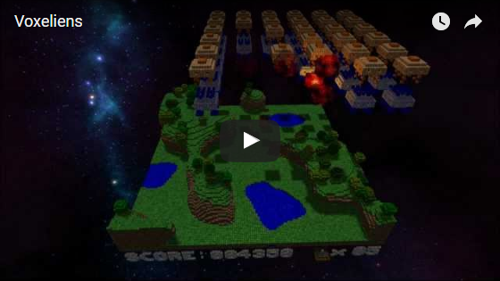

Voxeliens
=========

Voxeliens is a retro-style arcade shooter for the PC, in which you defend your planet from waves of descending enemies. The gameplay is simple and fast paced as you battle your way through different environments using a variety of powerups. Think Space Invaders would have been better in 3D? You’re right, so download Voxeliens for free and play today!

|

|

Features
--------

* Simple and fast-paced gameplay. Test your trigger finger and save the planet!
* Attractive voxel-based graphics capture the retro gaming spirit.
* Available for all recent versions of Windows (early Linux version).
* Everything ‘Space Invaders’ wishes it could have been!

|

Download
--------
* **Windows:** You can get Voxeliens for Windows from our `download page <https://bitbucket.org/volumesoffun/voxeliens/downloads>`_.

* **Linux:** We do not have pre-built binaries for Linux so you will need to compile yourself from source. You can find instructions for this at  `Install.rst <https://bitbucket.org/volumesoffun/voxeliens/src/master/Install.rst>`_.

|

Playing the game
----------------
The objectives of Voxeliens are to survive as many waves of enemies as possible and accumulate the highest score. The default controls are as follows:

* **W:** Move forward

* **S:** Move back

* **A:** Move left

* **D:** Move right

* **Mouse movement:** Rotate camera

* **Mouse click:** Fire cannon

In addition be aware of the following:
	- Powerups can be collected for better weapons.
	- An extra life will be gained for every 10,000 points.
	- Bonuses are awarded for completing a level quickly.
	- Enemies will descend and can crash into hills/trees, but this will cost you points.

Have fun!